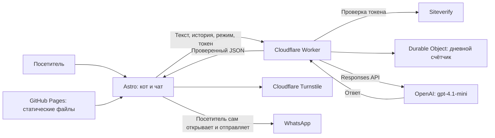
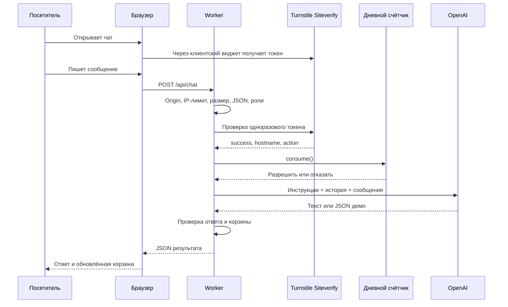
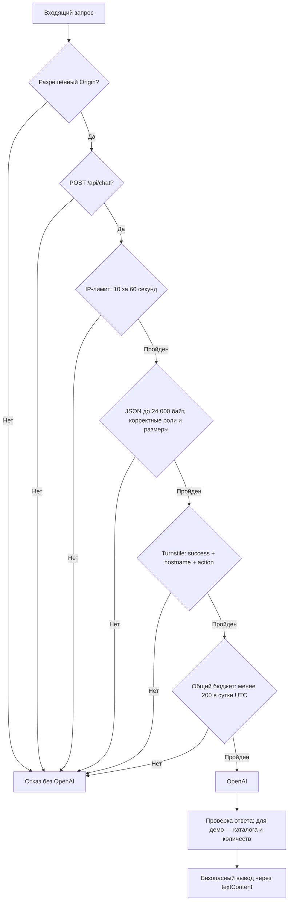
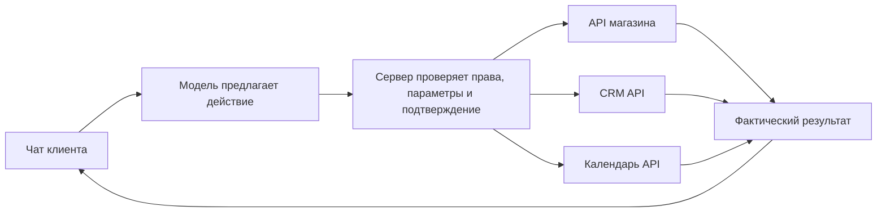

# Pixel — устройство ИИ-помощника HIRDA

Актуально: 10 октября 2026. Описание проверено по исходному коду. Секретные значения намеренно не включены.

## 1. Что уже работает

Pixel — интерфейс кота, чат и сервер, который обращается к готовой языковой модели OpenAI. Он консультирует по HIRDA, показывает демонстрацию заказа и готовит редактируемый текст обращения в WhatsApp.

Это не отдельная обученная нейросеть: мы не меняли веса модели и не делали fine-tuning. На каждом запросе сервер передаёт инструкции, сведения об услугах, цены, проекты и ограниченную историю разговора. Именно так сейчас устроено «обучение под бизнес»: меняем проверенные данные и инструкции.

Три режима:

| Режим | Назначение | Результат |
|---|---|---|
| `consult` | Вопросы об услугах и проектах HIRDA | Обычный текст |
| `demo` | Пример помощника кафе | Текст и структурированная демо-корзина |
| `brief` | Подготовка реального обращения Артёму | Черновик, который посетитель редактирует и сам отправляет |

Демо пока одно: Cappuccino 3,90 €, Croissant 2,80 €, Cheesecake 4,90 €. Это вымышленные предложения для демонстрации интерфейса. Нет оплаты, доставки, настоящей регистрации заказа, CRM или календаря. Кнопка завершения лишь объясняет возможности интеграции; она не создаёт заказ на сервере.

## 2. Из каких частей состоит



Frontend написан на Astro, TypeScript и CSS. Браузерный код управляет облаком приветствия, эмоциями кота, модальным окном, формой, историей и корзиной. Backend написан на JavaScript ES modules (`.mjs`), без Express. В интернете он работает в Cloudflare Workers; локально — в Node.js 24 через встроенный `node:http`.

GitHub Pages не умеет исполнять этот backend: это отдельные публикации. Обновление сайта через Git не обновляет Worker автоматически.

## 3. Где что лежит

Корень локального проекта: `/Users/artemgirda/Desktop/projects/astro-portfolio`.

| Файл относительно корня | Роль |
|---|---|
| `apps/portfolio/src/components/AIAssistantWidget.astro` | Весь интерфейс кота, события, отправка запросов, Turnstile, история, корзина и стили чата |
| `apps/portfolio/public/ai/` | Изображения кота и его эмоций |
| `apps/portfolio/src/data/pricing.json` | Прайс сайта, который также читает backend |
| `apps/portfolio/src/data/projects.ts` | Проекты, доступные помощнику |
| `apps/portfolio/src/config/contact.ts` | Номер WhatsApp |
| `apps/assistant-api/knowledge.mjs` | Системные инструкции, правила общения и подключения данных HIRDA |
| `apps/assistant-api/demo.mjs` | Фиксированный каталог, схема ответа модели и проверка корзины |
| `apps/assistant-api/api.mjs` | Проверка запроса, обращение к OpenAI, обработка ответа; локальный HTTP-обработчик |
| `apps/assistant-api/worker.mjs` | Публичная точка входа и последовательность защитных проверок |
| `apps/assistant-api/turnstile.mjs` | Серверная проверка Turnstile |
| `apps/assistant-api/budget.mjs` | Устойчивый суточный счётчик запросов в SQLite Durable Object |
| `apps/assistant-api/server.mjs` | Запуск локального API на 127.0.0.1:8787 |
| `apps/assistant-api/wrangler.jsonc` | Имя Worker, модель, лимиты, bindings и миграция SQLite |
| `apps/assistant-api/test.mjs` | Автоматические тесты API и корзины |
| `apps/assistant-api/.env` | Локальные секреты; не публиковать и не коммитить |
| `.github/workflows/deploy.yml` | Сборка и публикация всех сайтов на GitHub Pages |
| `scripts/build.mjs` | Общая сборка сайтов |

Файлы экспериментальных котов и `cat-lab` не являются обязательной частью текущего чата. Не удаляй их ради настройки Pixel.

## 4. Что происходит при сообщении



Клиент вызывает `POST https://hirda-cat-api.hirda-assistant-api.workers.dev/api/chat`. Сервер вызывает `POST https://api.openai.com/v1/responses` с моделью `gpt-4.1-mini`. Это Responses API, не Chat Completions. Вызов не потоковый: ответ появляется после окончания генерации.

Пример тела запроса, без действующего токена:

```json
{
  "lang": "de",
  "mode": "demo",
  "turnstileToken": "одноразовый токен виджета",
  "cart": [],
  "messages": [{ "role": "user", "content": "Zwei Cappuccino bitte" }]
}
```

Ответ демо содержит `text`, `cart` и `catalog`. Модель возвращает полное желаемое состояние корзины. Она не вызывает магазин и не списывает деньги. Сервер разрешает только известные идентификаторы и целые количества от 1 до 20, запрещает повторяющиеся позиции. Удалённая позиция отсутствует в массиве. Цены берутся из серверного каталога, не из текста модели. Интерфейс считает итог в целых центах и форматирует евро.

Structured Outputs (`text.format`, JSON Schema, `strict: true`) задаёт форму ответа. Это помогает разбирать ответ, но не гарантирует, что модель правильно поняла желание человека. Дополнительная проверка в коде обязательна. Для реального магазина потребуются проверка каталога/остатков и итоговое подтверждение заказа на сервере.

## 5. Ключи и настройки

| Название | Секрет? | Где используется |
|---|---|---|
| `OPENAI_API_KEY` | Да | Cloudflare Worker Secret; локально `.env`. Только backend |
| `TURNSTILE_SECRET` | Да | Worker Secret, обращение к Siteverify |
| Turnstile site key | Нет | В компоненте чата; допустимо видеть в браузере |
| `OPENAI_MODEL` | Нет | `wrangler.jsonc`, сейчас `gpt-4.1-mini` |
| `ALLOWED_ORIGIN` | Нет | Сейчас `https://girda.github.io` |
| `CHAT_DAILY_LIMIT` | Нет | Сейчас `200` запросов в сутки UTC |
| `PUBLIC_ASSISTANT_API_URL` | Нет | GitHub repository variable; встраивается во frontend при сборке |
| `PORT` | Нет | Локальный сервер, по умолчанию 8787 |
| `TEST_ACCESS_TOKEN` | Устаревший секрет | Текущий публичный обработчик его не проверяет; пароль больше не нужен |

Не ставь `PUBLIC_` перед секретными ключами: такие переменные могут попасть в браузерную сборку. Для запуска нужны аккаунты GitHub, Cloudflare и OpenAI API с доступом к модели и доступным балансом/биллингом. Подписка ChatGPT и оплата API — разные вещи.

Локальная `.env` не переносится на Cloudflare автоматически. Секреты production задаются в настройках Worker или через Wrangler. Не вставляй значения в документацию, git, скриншоты, командные аргументы или чат. При утечке ключ нужно отозвать и заменить.

## 6. Защита: что именно проверяется



- Origin должен точно совпадать с настройкой. CORS защищает браузерное взаимодействие, но не является авторизацией: внешняя программа может подставить Origin.
- Cloudflare даёт IP через `CF-Connecting-IP`. Лимит — 10 обращений за 60 секунд по IP; это распределённый edge-лимит, не точный глобальный счётчик всех запросов одного человека.
- Принимается JSON до 24 000 байт. История: 1–11 сообщений, роли строго чередуются `user`/`assistant`, первое и последнее — от пользователя. `system`/`developer` из браузера запрещены.
- Сервер допускает до 1000 символов в пользовательском сообщении, до 4000 в ответе истории, суммарно до 16 000. Само поле ввода UI ограничено 350 символами.
- Turnstile проверяется сервером: `success`, hostname `girda.github.io` и action `pixel_chat`. Ошибка сети не открывает доступ. Одного наличия токена недостаточно.
- Виджет использует `appearance: interaction-only`: нет постоянной плашки, но Cloudflare может показать проверку, если нужно действие посетителя. Защита не удалена.
- Durable Object атомарно сохраняет число запросов за текущую дату UTC. После 200 разрешённых попыток запросы блокируются. Неудача OpenAI после списания тоже расходует попытку; автоматического возврата нет.
- Вызов OpenAI ограничен 20 секундами; клиент ждёт до 25 секунд. Siteverify имеет собственные 10 секунд, поэтому при медленных сервисах общий запрос может превысить клиентское ожидание.
- Ответ ограничен 600 выходными токенами, демо — 900. Это не ограничение в евро: входной контекст также оплачивается.
- Ключ передаётся OpenAI только сервером в Authorization. Ошибки наружу возвращаются короткими кодами, без upstream-текста и секретов.
- Вывод через `textContent` не исполняет HTML из ответа. WhatsApp URL формируется кодом с фиксированным номером, а не произвольной ссылкой модели.

Инструкции против prompt injection снижают риск, но не дают математической гарантии поведения. История приходит из браузера и может быть изменена пользователем. Поэтому модель сейчас не имеет доступа к оплате, чужим данным и реальным заказам. Демо-корзина тоже не является доверенным заказом.

## 7. Где хранятся разговоры

История и корзина находятся в памяти вкладки, а не в базе заказов. После перезагрузки они теряются. Переключение между консультацией и демо сохраняет отдельные состояния до перезагрузки. История ограничена; бесконечной памяти нет.

Наш Durable Object хранит только дату и число запросов. Приложение не записывает полный чат в собственную БД. Текст всё равно отправляется OpenAI для обработки. `store: false` передаётся в Responses API, но это не обещание нулевого хранения у всех провайдеров: условия обработки и служебных журналов нужно сверять с политиками OpenAI/Cloudflare. В Cloudflare включена observability, sampling traces — 1%; не добавляй логирование тела сообщений или ключей.

## 8. Как изменять и запускать

Локально, в разных терминалах:

```sh
cd /Users/artemgirda/Desktop/projects/astro-portfolio/apps/assistant-api
npm run dev
```

```sh
cd /Users/artemgirda/Desktop/projects/astro-portfolio/apps/portfolio
npm run dev -- --port 4321
```

Node.js нужен версии 24 или выше. Ключ лежит в `.env` backend. Локальный frontend обращается к `127.0.0.1:8787`; локальный сервер принимает только localhost:4321 / 127.0.0.1:4321 и не требует Turnstile. Это режим разработки, его нельзя просто открыть в интернет. Он имеет отдельные ограничения: 20 запросов в минуту на процесс и максимум два одновременно.

Проверки:

```sh
cd /Users/artemgirda/Desktop/projects/astro-portfolio/apps/assistant-api
npm test
cd /Users/artemgirda/Desktop/projects/astro-portfolio
npm run build
```

Чтобы поменять знания, редактируй `knowledge.mjs`, прайс или проекты и публикуй backend заново. Изменение только сайта не обновляет уже собранные знания Worker. Каталог демо меняется в `demo.mjs`; после этого нужно согласовать приветствие в компоненте. Название модели меняется в `wrangler.jsonc` и локальной конфигурации отдельно.

Публикация состоит из двух шагов: deploy Worker через Wrangler в аккаунт владельца, затем commit/push frontend в `main`, после которого GitHub Actions собирает GitHub Pages. Секреты остаются в Cloudflare, не добавляются в коммит. После публикации проверь обычный вопрос, демо-заказ, изменение количества и отказ запроса без Turnstile.

## 9. Ошибки и диагностика

| Код | Что проверить |
|---|---|
| `forbidden` | Origin, адрес страницы, наличие Cloudflare IP |
| `verification_failed` | Turnstile, разрешённый hostname, secret, свежий токен, блокировщики |
| `rate_limited` | Локальный/IP-лимит либо ограничение OpenAI; немного подождать |
| `daily_limit` | Исчерпаны 200 попыток UTC; не увеличивать без оценки расходов |
| `not_configured` | OPENAI_API_KEY или обязательные bindings/secrets |
| `invalid_request` | Язык, история, роли и размеры |
| `invalid_cart` | Неизвестный товар, повтор, количество вне диапазона |
| `invalid_response` | Неполный ответ, отказ/неожиданная структура, некорректная корзина |
| `upstream_unavailable` | Доступность OpenAI, ключ, timeout, доступ к модели |

Смотри GitHub Actions для сборки сайта, Cloudflare Workers для backend и DevTools → Network для статуса `/api/chat`. Не публикуй скриншоты с секретами. Неудачный запрос после проверки может уже расходовать дневной лимит.

## 10. Как превратить это в помощника клиента

Можно переиспользовать код, но каждому бизнесу нужны свои знания, каталог, настройки и права. Для первых клиентов проще отдельная конфигурация/развёртывание, чтобы не смешивать данные. Мультитенантность потребует серверного разделения клиентов и авторизации, одного `businessId` от браузера недостаточно.



Для настоящих действий понадобится tool/function calling или другой строго проверяемый протокол. Модель предлагает действие, сервер решает, допустимо ли оно, вызывает API и возвращает фактический результат. Нельзя отвечать «записал», пока календарь не подтвердил запись.

Разумный следующий этап: каталог клиента → проверка наличия → сбор заявки → подтверждение посетителем → запись заявки в БД/CRM → уведомление владельцу. Затем уже оплата и сложная автоматизация. Понадобятся отдельные API-ключи интеграций, обработка ошибок, защита от дублей (idempotency), журнал действий и правила доступа. Для больших знаний можно добавить поиск по документам (RAG), но сейчас его нет.

## Справочные ссылки

- [Turnstile: видимость виджета](https://developers.cloudflare.com/turnstile/get-started/client-side-rendering/widget-configurations/)
- [Turnstile: серверная проверка](https://developers.cloudflare.com/turnstile/get-started/server-side-validation/)
- [OpenAI Structured Outputs](https://developers.openai.com/api/docs/guides/structured-outputs)
- [OpenAI: обработка данных API](https://platform.openai.com/docs/guides/your-data)
- [Cloudflare Workers](https://developers.cloudflare.com/workers/)

Схемы написаны в Mermaid: GitHub отображает их прямо в Markdown. В VS Code при необходимости используй просмотр Markdown с поддержкой Mermaid.
